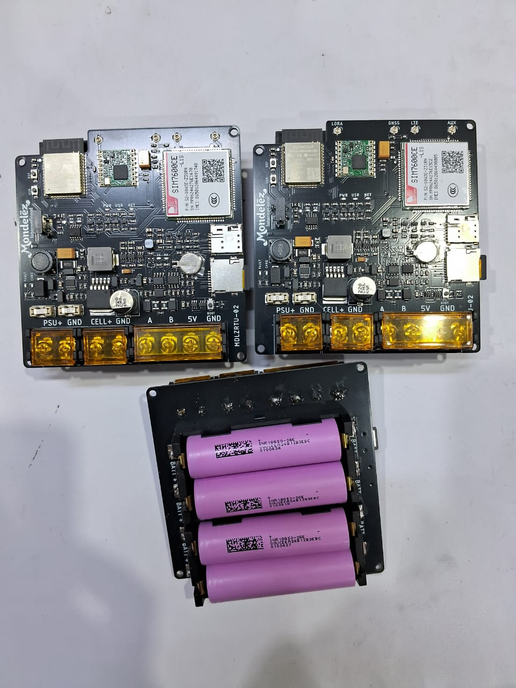
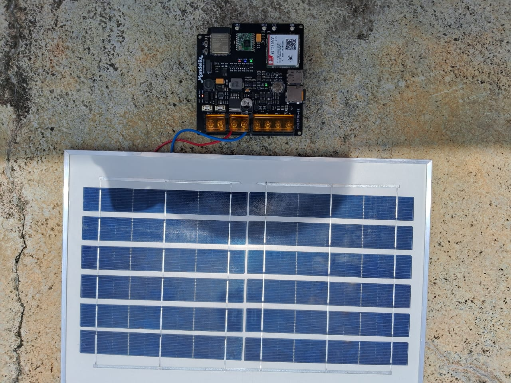

# Introduction
This project is a temperature and humidity monitoring system on a cocoa plantation owned by Mondelez International. https://www.youtube.com/watch?v=lCQ0-mQSUiQ

## Specs:
1. Microcontroller ESP32-WROOM-32-16N
2. SIM7600 4G LTE Module
3. SX1278 LORA MODULE
4. LTC3652 MPPT SHOLAR SHARGER CONTROLLER UPTO 10W
5. DS3231 RTC Module
6. MICROSD 
7. RS485 DRIVER FOR SHT31
8. Power (Adaptor 9V, Solar cell 7WP, Li-Ion Battery)
9. BMS FOR LI-ION 1S4P

### Dokumentation

